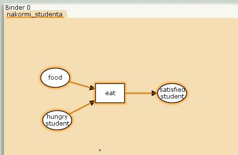
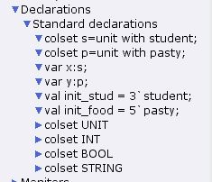
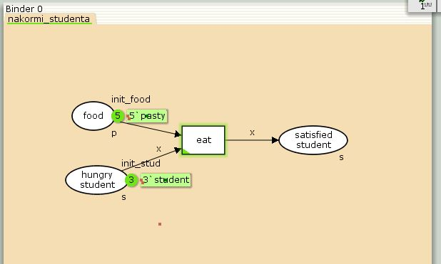
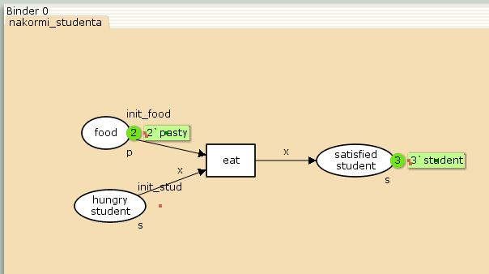
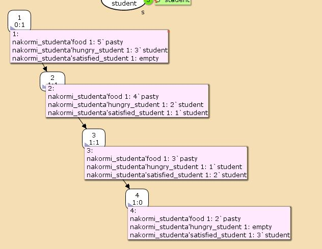

---
## Front matter
title: "Лабораторная работа №9"
subtitle: "Задание для самостоятельного выполнения"
author: "Игнатенкова Варвара Николаевна"

## Generic otions
lang: ru-RU
toc-title: "Содержание"

## Bibliography
bibliography: bib/cite.bib
csl: pandoc/csl/gost-r-7-0-5-2008-numeric.csl

## Pdf output format
toc: true # Table of contents
toc-depth: 2
lof: true # List of figures
lot: false # List of tables
fontsize: 12pt
linestretch: 1.5
papersize: a4
documentclass: scrreprt
## I18n polyglossia
polyglossia-lang:
  name: russian
  options:
	- spelling=modern
	- babelshorthands=true
polyglossia-otherlangs:
  name: english
## I18n babel
babel-lang: russian
babel-otherlangs: english
## Fonts
mainfont: PT Serif
romanfont: PT Serif
sansfont: PT Sans
monofont: PT Mono
mainfontoptions: Ligatures=TeX
romanfontoptions: Ligatures=TeX
sansfontoptions: Ligatures=TeX,Scale=MatchLowercase
monofontoptions: Scale=MatchLowercase,Scale=0.9
## Biblatex
biblatex: true
biblio-style: "gost-numeric"
biblatexoptions:
  - parentracker=true
  - backend=biber
  - hyperref=auto
  - language=auto
  - autolang=other*
  - citestyle=gost-numeric
## Pandoc-crossref LaTeX customization
figureTitle: "Рис."
tableTitle: "Таблица"
listingTitle: "Листинг"
lofTitle: "Список иллюстраций"
lotTitle: "Список таблиц"
lolTitle: "Листинги"
## Misc options
indent: true
header-includes:
  - \usepackage{indentfirst}
  - \usepackage{float} # keep figures where there are in the text
  - \floatplacement{figure}{H} # keep figures where there are in the text
---

# Цель работы

Выполнить задание для самостоятельного выполнения.

# Задание

1. Построить модели с помощью CPNTools задачи  «Накорми студентов».

2. Вычислить пространство состояний. Сформировать отчёт о пространстве состояний и проанализируйте его. Постройте граф пространства состояний.

# Выполнение лабораторной работы

Рассмотрим пример студентов, обедающих пирогами. Голодный студент становится сытым после того, как съедает пирог. Таким образом, имеем:– два типа фишек: «пироги» и «студенты»;– три позиции: «голодный студент», «пирожки», «сытый студент»;– один переход: «съесть пирожок».

 1. Рисуем граф сети. Для этого с помощью контекстного меню создаём новую сеть, добавляем позиции, переход и дуги 

{#fig:001 width=70%}

 2.  В меню задаём новые декларации модели: типы фишек, начальные значения позиций, выражения для дуг. Для этого наведя мышку на меню Standart declarations, правой кнопкой вызываем контекстное меню и выбираем New Decl.

 После этого задаем тип s фишкам, относящимся к студентам, тип p — фишкам, относящимся к пирогам, задаём значения переменных x и y для дуг и начальные значения мультимножеств init_stud и init_food.

{#fig:002 width=70%}

Врезультате получаем работающую моделью

{#fig:003 width=70%}

После запуска фишки типа «пирожки» из позиции «еда» и фишки типа «студенты» из позиции «голодный студент», пройдя через переход «кушать», попадают в позицию «сытый студент» и преобразуются в тип «студенты»

{#fig:004 width=70%}

Упражнение. Вычислите пространство состояний. Сформируйте отчёт о пространстве состояний и проанализируйте его. Постройте граф пространства состояний.

{#fig:005 width=70%}

Отчет:

# Выводы

Мы построили модель «Накорми студентов» и проанализировали результат.