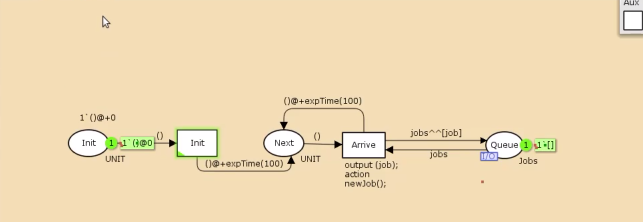
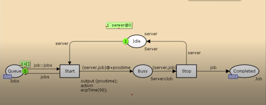
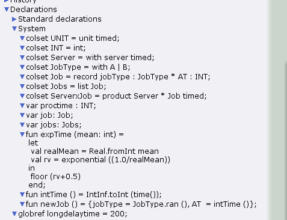
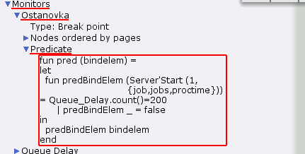

---
## Front matter
lang: ru-RU
title: Лабораторная работа №11
subtitle: Задание для самостоятельного выполнения
author:
  - Игнатенкова В. Н.
institute:
  - Российский университет дружбы народов, Москва, Россия

## i18n babel
babel-lang: russian
babel-otherlangs: english

## Formatting pdf
toc: false
toc-title: Содержание
slide_level: 2
aspectratio: 169
section-titles: true
theme: metropolis
header-includes:
 - \metroset{progressbar=frametitle,sectionpage=progressbar,numbering=fraction}
 - '\makeatletter'
 - '\beamer@ignorenonframefalse'
 - '\makeatother'
---

# Информация

## Докладчик

:::::::::::::: {.columns align=center}
::: {.column width="60%"}

  * Игнатенкова Варвара Николаевна
  * студентка
  * Российский университет дружбы народов
  * [1132226497@pfur.ru](mailto:1132226497@pfur.ru)
  * <https://github.com/vnignatenkovarudn>

:::
::: {.column width="25%"}

:::
::::::::::::::
## Цель работы

Реализовать модель $M|M|1$ в CPN tools.

## Задание

- Реализовать в CPN Tools модель системы массового обслуживания M|M|1.
- Настроить мониторинг параметров моделируемой системы и нарисовать графики очереди.

## Выполнение лабораторной работы

В систему поступает поток заявок двух типов, распределённый по пуассоновскому
закону. Заявки поступают в очередь сервера на обработку. Дисциплина очереди -
FIFO. Если сервер находится в режиме ожидания (нет заявок на сервере), то заявка
поступает на обработку сервером.

Будем использовать три отдельных листа: на первом листе опишем граф системы, на втором — генератор заявок, на третьем — сервер обработки
заявок.

## Выполнение лабораторной работы

Сеть имеет 2 позиции (очередь — `Queue`, обслуженные заявки — `Complited`)
и два перехода (генерировать заявку — `Arrivals`, передать заявку на обработку сер-
веру — `Server`). Переходы имеют сложную иерархическую структуру, задаваемую
на отдельных листах модели (с помощью соответствующего инструмента меню —
Hierarchy).

Между переходом `Arrivals` и позицией `Queue`, а также между позицией `Queue`
и переходом `Server` установлена дуплексная связь. Между переходом `Server` и позицией `Complited` — односторонняя связь.

## Выполнение лабораторной работы

{#fig:001 width=70%}

## Выполнение лабораторной работы

Граф генератора заявок имеет 3 позиции (текущая заявка — `Init`, следующая
заявка — `Next`, очередь — `Queue` из листа `System`) и 2 перехода (`Init` — определяет
распределение поступления заявок по экспоненциальному закону с интенсивностью
100 заявок в единицу времени, `Arrive` — определяет поступление заявок в очередь).

## Выполнение лабораторной работы

{#fig:002 width=70%}

## Выполнение лабораторной работы

Граф процесса обработки заявок на сервере имеет 4 позиции (`Busy` — сервер
занят, `Idle` — сервер в режиме ожидания, `Queue` и `Complited` из листа `System`) и 2
перехода (`Start` — начать обработку заявки, `Stop` — закончить обработку заявки).

## Выполнение лабораторной работы

{#fig:003 width=70%}

## Выполнение лабораторной работы

Зададим декларации системы.

Определим множества цветов системы (colorset) и переменные модели, а также определим функции системы.

## Выполнение лабораторной работы

{#fig:004 width=70%}

## Выполнение лабораторной работы

Зададим параметры модели на графах сети.

На листе `System` (рис. [-@fig:005]):

- у позиции Queue множество цветов фишек — `Jobs`; начальная маркировка `1[]`
определяет, что изначально очередь пуста.
- у позиции `Completed` множество цветов фишек — `Job`.

## Выполнение лабораторной работы

На листе Arrivals:

- у позиции `Init`: множество цветов фишек — `UNIT`; начальная маркировка `1``()@0`
определяет, что поступление заявок в систему начинается с нулевого момента
времени;
- у позиции `Next`: множество цветов фишек — `UNIT`;
- на дуге от позиции `Init` к переходу `Init` выражение () задаёт генерацию заявок;
- на дуге от переходов `Init` и Arrive к позиции Next выражение
`()@+expTime(100)` задаёт экспоненциальное распределение времени между
поступлениями заявок;
- на дуге от позиции `Next` к переходу `Arrive` выражение () задаёт перемещение
фишки;
- на дуге от перехода `Arrive` к позиции Queue выражение `jobs^^[job]` задает
поступление заявки в очередь;
- на дуге от позиции `Queue` к переходу `Arrive` выражение `jobs` задаёт обратную
связь.

## Выполнение лабораторной работы

На листе Server:

- у позиции `Busy`: множество цветов фишек — `Server`, начальное значение мар-
кировки — `1``server@0` определяет, что изначально на сервере нет заявок на
обслуживание;
- у позиции `Idle`: множество цветов фишек — `ServerxJob`;
- переход `Start` имеет сегмент кода
`output (proctime); action expTime(90);` определяющий, что время обслуживания заявки распределено по экспоненциальному закону со средним
временем обработки в 90 единиц времени;
- на дуге от позиции `Queue` к переходу `Start` выражение `job::jobs` определяет,
что сервер может начать обработку заявки, если в очереди есть хотя бы одна
заявка;
- на дуге от перехода `Start` к позиции Busy выражение
`(server,job)@+proctime` запускает функцию расчёта времени обработки заявки на сервере;
- на дуге от позиции `Busy` к переходу `Stop` выражение `(server,job)` говорит
о завершении обработки заявки на сервере;
- на дуге от перехода `Stop` к позиции `Completed` выражение `job` показывает, что
заявка считается обслуженной;
- выражение server на дугах от и к позиции `Idle` определяет изменение состояние
сервера (обрабатывает заявки или ожидает);
- на дуге от перехода `Start` к позиции `Queue` выражение `jobs` задаёт обратную
связь.

## Выполнение лабораторной работы

**Мониторинг параметров моделируемой системы**

Потребуется палитра Monitoring. Выбираем Break Point (точка останова) и устанавливаем её на переход Start. После этого в разделе меню Monitor появится новый подраздел, который назовём Ostanovka. В этом подразделе необходимо внести изменения в функцию Predicate, которая будет выполняться при запуске монитора. Зададим число шагов, через которое будем останавливать мониторинг. Для этого true заменим на Queue_Delay.count()=200. 

## Выполнение лабораторной работы

{#fig:008 width=70%}

## Выполнение лабораторной работы

Необходимо определить конструкцию Queue_Delay.count(). С помощью палитры Monitoring выбираем Data Call и устанавливаем на переходе Start. Появившийся в меню монитор называем Queue Delay (без подчеркивания). Функция Observer выполняется тогда, когда функция предикатора выдаёт значение true. По умолчанию функция выдаёт 0 или унарный минус (~1), подчёркивание обозначает произвольный аргумент. Изменим её так, чтобы получить значение задержки в очереди. Для этого необходимо из текущего времени intTime() вычесть временную метку AT , означающую приход заявки в очередь.

## Выполнение лабораторной работы

{#fig:009 width=70%}

## Выполнение лабораторной работы

После запуска программы на выполнение в каталоге с кодом программы появится файл Queue_Delay.log, содержащий в первой колонке — значение задержки
очереди, во второй — счётчик, в третьей — шаг, в четвёртой — время. 

## Выполнение лабораторной работы

{#fig:010 width=70%}

## Выполнение лабораторной работы

С помощью gnuplot можно построить график значений задержки в очереди.

## Выполнение лабораторной работы

{#fig:011 width=70%}

## Выполнение лабораторной работы

Посчитаем задержку в действительных значениях. С помощью палитры Monitoring
выбираем Data Call и устанавливаем на переходе Start. Появившийся в меню
монитор называем Queue Delay Real. Функцию Observer изменим следующим образом.

## Выполнение лабораторной работы

{#fig:012 width=70%}

## Выполнение лабораторной работы

По сравнению с предыдущим описанием функции добавлено преобразование значения функции из целого в действительное, при этом obsBindElem _ принимает значение ~1.0. После запуска программы на выполнение в каталоге с кодом программы появится файл Queue_Delay_Real.log с содержимым, аналогичным содержимому файла Queue_Delay.log, но значения задержки имеют действительный тип.

## Выполнение лабораторной работы

{#fig:013 width=70%}

## Выполнение лабораторной работы

Посчитаем, сколько раз задержка превысила заданное значение. С помощью палитры Monitoring выбираем Data Call и устанавливаем на переходе Start. Монитор называем Long Delay Time.
Функцию Observer изменим следующим образом.

## Выполнение лабораторной работы

{#fig:014 width=70%}

## Выполнение лабораторной работы

При этом необходимо в декларациях задать глобальную переменную
(в форме ссылки на число 200): longdelaytime.

После запуска программы на выполнение в каталоге с кодом программы появится файл Long_Delay_Time.log.

## Выполнение лабораторной работы

{#fig:016 width=70%}

## Выполнение лабораторной работы

С помощью gnuplot можно построить график, демонстрирующий, в какие периоды времени значения задержки в очереди превышали заданное значение 200.

## Выполнение лабораторной работы

{#fig:017 width=70%}

## Выводы

МВ процессе выполнения данной лабораторной работы я реализовала модель системы массового обслуживания $M|M|1$ в CPN Tools.ы построили модель задачи о мудрецах с помощью CPNTools и проанализировали результат.