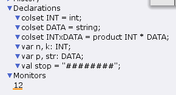
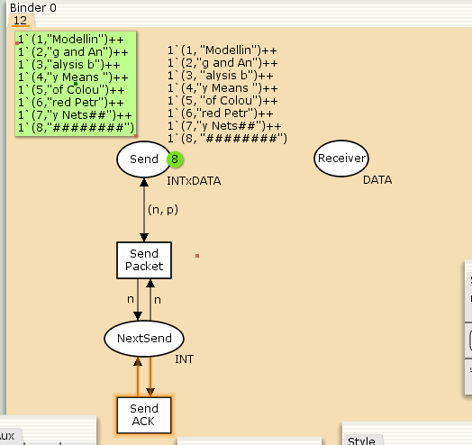
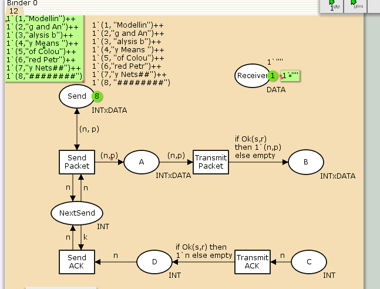
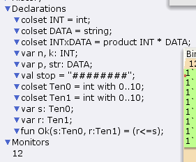
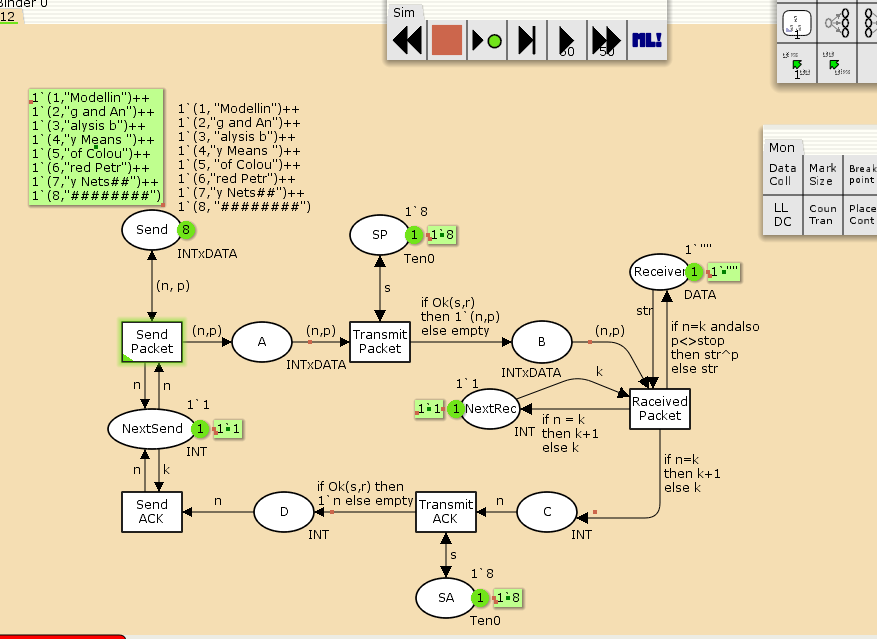
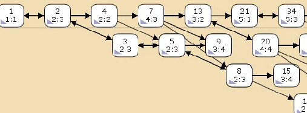

---
## Front matter
lang: ru-RU
title: Лабораторная работа №11
subtitle: Задание для самостоятельного выполнения
author:
  - Игнатенкова В. Н.
institute:
  - Российский университет дружбы народов, Москва, Россия

## i18n babel
babel-lang: russian
babel-otherlangs: english

## Formatting pdf
toc: false
toc-title: Содержание
slide_level: 2
aspectratio: 169
section-titles: true
theme: metropolis
header-includes:
 - \metroset{progressbar=frametitle,sectionpage=progressbar,numbering=fraction}
 - '\makeatletter'
 - '\beamer@ignorenonframefalse'
 - '\makeatother'
---

# Информация

## Докладчик

:::::::::::::: {.columns align=center}
::: {.column width="60%"}

  * Игнатенкова Варвара Николаевна
  * студентка
  * Российский университет дружбы народов
  * [1132226497@pfur.ru](mailto:1132226497@pfur.ru)
  * <https://github.com/vnignatenkovarudn>

:::
::: {.column width="25%"}

:::
::::::::::::::
## Цель работы

Реализовать ненадёжную сеть передачи данных, состоящую из источника, получателя в CPN tools.

## Задание

- Реализовать в CPN Tools ненадёжную сеть передачи данных, состоящую из источника, получателя.
-  Вычислить пространство состояний. Сформировать отчёт о пространстве состояний и проанализировать его. Построить граф пространства состояний.

## Выполнение лабораторной работы

Рассмотрим ненадёжную сеть передачи данных, состоящую из источника получателя. Перед отправкой очередной порции данных источник должен получить от получателя подтверждение о доставке предыдущей порции данных. Считаем, что пакет состоит из номера пакета и строковых данных. Передавать будем сообщение «Modelling and Analysis by Means of Coloured Petry Nets», разбитое по 8 символов.

## Выполнение лабораторной работы

{#fig:001 width=70%}

## Выполнение лабораторной работы

{#fig:002 width=70%}

## Выполнение лабораторной работы

Cостояние Send имеет тип INTxDATA и начальную маркировку (в соответствии с передаваемой фразой). Стоповый байт ("########") определяет, что сообщение закончилось.

Состояние Receiver имеет тип DATA и начальное значение 1`"" (т.е. пустая строка, поскольку состояние собирает данные и номер пакета его не интересует).

Состояние NextSend имеет тип INT и начальное значение 1`1. Поскольк пакеты представляют собой кортеж, состоящий из номера пакета и строки, то выражение у двусторонней дуги будет иметь значение (n,p).

## Выполнение лабораторной работы

Кроме того, необходимо взаимодействовать с состоянием, которое будет сообщать номер следующего посылаемого пакета данных. Поэтому переход Send Packet соединяем с состоянием NextSend двумя дугами с выражениями n.

Также необходимо получать информацию с подтверждениями о получении данных. От перехода Send Packet к состоянию NextSend дуга с выражением n, обратно — k.

## Выполнение лабораторной работы

{#fig:003 width=70%}

## Выполнение лабораторной работы

ададим промежуточные состояния (A, B с типом INTxDATA, C, D с типом INTxDATA) для переходов: передать пакет Transmit Packet (передаём (n,p)), передать подтверждение Transmit ACK (передаём целое число k).

Добавляем переход получения пакета (Receive Packet).

От состояния Receiver идёт дуга к переходу Receive Packet со значением той строки (str), которая находится в состоянии Receiver. Обратно: проверяем, что номер пакета новый и строка не равна стоп-биту. Если это так, то строку добавляем к полученным данным.

## Выполнение лабораторной работы

Кроме того, необходимо знать, каким будет номер следующего пакета. Для этого добавляем состояние NextRec с типом INT и начальным значением 1`1(одинпакет), связываем его дугами с переходом Receive Packet. Причём к переходу идёт дуга с выражением k, от перехода — if n=k then k+1 else k.

Связываем состояния B и C с переходом Receive Packet. От состояния B к переходу Receive Packet — выражение (n,p), от перехода Receive Packet к состоянию C — выражение if n=k then k+1 else k.

## Выполнение лабораторной работы

От перехода Receive Packet к состоянию Receiver: if n=k andalso p<>stop then str^p else str (если n=k и мы не получили стоп-байт, то направляем в состояние строку и к ней прикрепляем p, в противном случае посылаем толко строку).

На переходах Transmit Packet и Transmit ACK зададим потерю пакетов. Для этого на интервале от 0 до 10 зададим пороговое значение и, если передаваемое значение превысит этот порог, то считаем, что произошла потеря пакета, если нет, то передаём пакет дальше Для этого задаём вспомогательные состояния SP и SA с типом Ten0 и начальным значением 1`8, соединяем с соответствующими переходами.

## Выполнение лабораторной работы

{#fig:004 width=70%}

## Выполнение лабораторной работы

Задаём выражение от перехода Transmit Packet к состоянию B и выражение от перехода Transmit ACK к состоянию D.

Таким образом, получим модель простого протокола передачи данных.

## Выполнение лабораторной работы

{#fig:005 width=70%}

## Выполнение лабораторной работы

Пакет последовательно проходит: состояние Send, переход Send Packet, состояние A, с некоторой вероятностью переход Transmit Packet, состояние B, попадает на переход Receive Packet, где проверяется номер пакета и если нет совпадения, то пакет направляется в состояние Received, а номер пакета передаётся последовательно в состояние C, с некоторой вероятностью в переход Transmit ACK, далее в состояние D, переход Receive ACK, состояние NextSend (увеличивая на 1 номер следующего пакета), переход Send Packet. Так продолжается до тех пор, пока не будут переданы все части сообщения. Последней будет передана стоппоследовательность.

## Выполнение лабораторной работы

Вычислим пространство состояний. Прежде, чем пространство состояний может быть вычислено и проанализировано, необходимо сформировать код пространства состояний. Этот код создается, когда используется инструмент Войти в пространство состояний. Вход в пространство состояний занимает некоторое время. Затем, если ожидается, что пространство состояний будет небольшим, можно просто применить инструмент Вычислить пространство состояний к листу, содержащему страницу сети. Сформируем отчёт о пространстве состояний и проанализируем его. Чтобы сохранить отчет, необходимо применить инструмент Сохранить отчет о пространстве состояний к листу, содержащему страницу сети и ввести имя файла отчета.

## Выполнение лабораторной работы

Statistics
------------------------------------------------------------------------

  State Space
     Nodes:  13341
     Arcs:   206461
     Secs:   300
     Status: Partial

  Scc Graph
     Nodes:  6975
     Arcs:   170859
     Secs:   14

 Boundedness Properties

## Выполнение лабораторной работы

  Best Integer Bounds
                             Upper      Lower
     Main'A 1                20         0
     Main'B 1                10         0
     Main'C 1                6          0
     Main'D 1                5          0
     Main'NextRec 1          1          1
     Main'NextSend 1         1          1
     Main'Reciever 1         1          1
     Main'SA 1               1          1
     Main'SP 1               1          1
     Main'Send 1             8          8

## Выполнение лабораторной работы

  Best Upper Multi-set Bounds
     Main'A 1            20`(1,"Modellin")++
15`(2,"g and An")++
9`(3,"alysis b")++
4`(4,"y Means ")
     Main'B 1            10`(1,"Modellin")++
7`(2,"g and An")++
4`(3,"alysis b")++
2`(4,"y Means ")
     Main'C 1            6`2++
5`3++
3`4++
1`5

## Выполнение лабораторной работы

     Main'D 1            5`2++
3`3++
2`4++
1`5
     Main'NextRec 1      1`1++
1`2++
1`3++
1`4++
1`5
     Main'NextSend 1     1`1++
1`2++
1`3++
1`4

## Выполнение лабораторной работы

     Main'Reciever 1     1`""++
1`"Modellin"++
1`"Modelling and An"++
1`"Modelling and Analysis b"++
1`"Modelling and Analysis by Means "
     Main'SA 1           1`8
     Main'SP 1           1`8
     Main'Send 1         1`(1,"Modellin")++

## Выполнение лабораторной работы

1`(2,"g and An")++
1`(3,"alysis b")++
1`(4,"y Means ")++
1`(5,"of Colou")++
1`(6,"red Petr")++
1`(7,"y Nets##")++
1`(8,"########")

## Выполнение лабораторной работы

  Best Lower Multi-set Bounds
     Main'A 1            empty
     Main'B 1            empty
     Main'C 1            empty
     Main'D 1            empty
     Main'NextRec 1      empty
     Main'NextSend 1     empty
     Main'Reciever 1     empty
     Main'SA 1           1`8
     Main'SP 1           1`8
     Main'Send 1         1`(1,"Modellin")++

## Выполнение лабораторной работы

1`(2,"g and An")++
1`(3,"alysis b")++
1`(4,"y Means ")++
1`(5,"of Colou")++
1`(6,"red Petr")++
1`(7,"y Nets##")++
1`(8,"########")

## Выполнение лабораторной работы

 Home Properties

  Home Markings
     None

## Выполнение лабораторной работы

 Liveness Properties

  Dead Markings
     4675 [9999,9998,9997,9996,9995,...]

  Dead Transition Instances
     None

  Live Transition Instances
     None

## Выполнение лабораторной работы

 Fairness Properties
       Main'Recieved_Packet 1 No Fairness
       Main'Send_ACK 1        No Fairness
       Main'Send_Packet 1     Impartial
       Main'Transmit_ACK 1    No Fairness
       Main'Transmit_Packet 1 Impartial

## Выполнение лабораторной работы

Сформируем начало графа пространства состояний, так как все они не поместятся.

## Выполнение лабораторной работы

{#fig:006 width=70%}

## Выводы

В процессе выполнения данной лабораторной работы я реализовала модель простого протокола передачи данных.