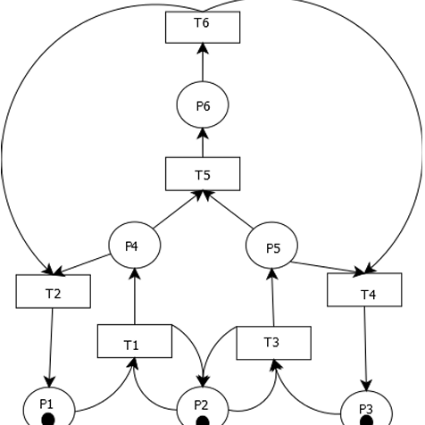
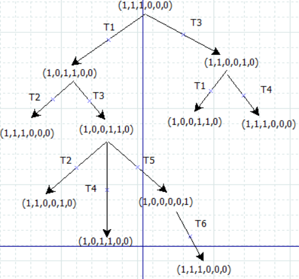
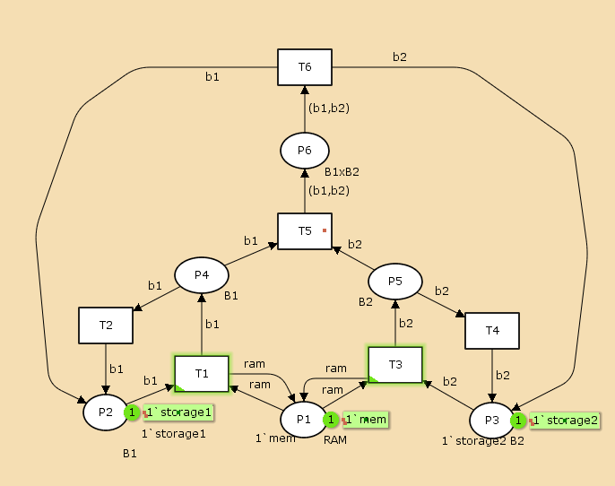
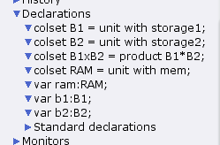
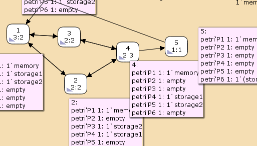

---
## Front matter
lang: ru-RU
title: Лабораторная работа №13
subtitle: Задание для самостоятельного выполнения
author:
  - Игнатенкова В. Н.
institute:
  - Российский университет дружбы народов, Москва, Россия

## i18n babel
babel-lang: russian
babel-otherlangs: english

## Formatting pdf
toc: false
toc-title: Содержание
slide_level: 2
aspectratio: 169
section-titles: true
theme: metropolis
header-includes:
 - \metroset{progressbar=frametitle,sectionpage=progressbar,numbering=fraction}
 - '\makeatletter'
 - '\beamer@ignorenonframefalse'
 - '\makeatother'
---

# Информация

## Докладчик

:::::::::::::: {.columns align=center}
::: {.column width="60%"}

  * Игнатенкова Варвара Николаевна
  * студентка
  * Российский университет дружбы народов
  * [1132226497@pfur.ru](mailto:1132226497@pfur.ru)
  * <https://github.com/vnignatenkovarudn>

:::
::: {.column width="25%"}

:::
::::::::::::::
## Цель работы

Реализовать ненадёжную сеть передачи данных, состоящую из источника, получателя в CPN tools.

## Задание

1. Используя теоретические методы анализа сетей Петри, провести анализ сети (с помощью построения дерева достижимости). Определить, является ли сеть безопасной, ограниченной, сохраняющей, имеются ли
тупики.
2. Промоделировать сеть Петри с помощью CPNTools.
3. Вычислить пространство состояний. Сформировать отчёт о пространстве состояний и проанализировать его.Построить граф пространства состояний.

## Описание модели

{#fig:001 width=70%}

## Анализ сети Петри

{#fig:002 width=70%}

## Реализация модели в CPN Tools

{#fig:003 width=70%}

## Реализация модели в CPN Tools

{#fig:004 width=70%}добавляем к полученным данным.

## Пространство состояний

{#fig:005 width=70%}

## Пространство состояний

 Statistics
------------------------------------------------------------------------

  State Space
     Nodes:  5
     Arcs:   10
     Secs:   0
     Status: Full

  Scc Graph
     Nodes:  1
     Arcs:   0
     Secs:   0

## Выводы

Я сделала задание для самостоятельного выполнения: провела анализ сети с помощью дерева достижимости, промедилировала эту сеть Петри с помощью  CPNTools, вычислила пространство состояний и проанализировала его и построила граф пространства состояний.