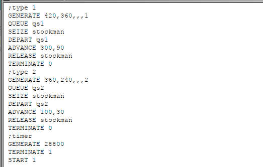
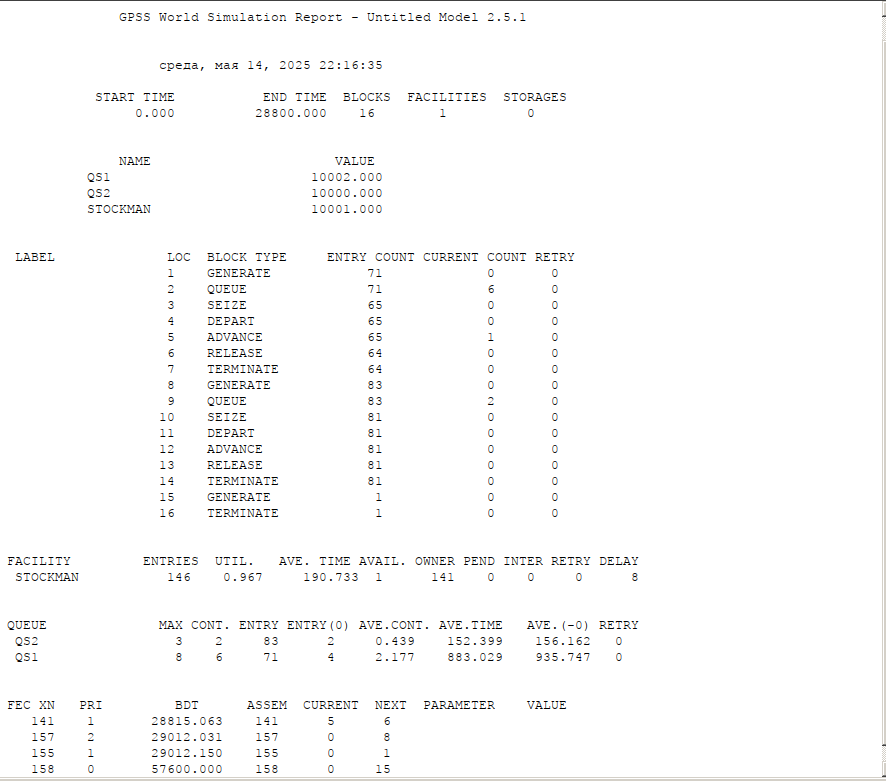
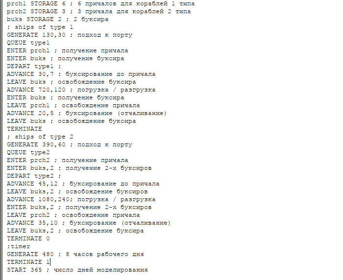
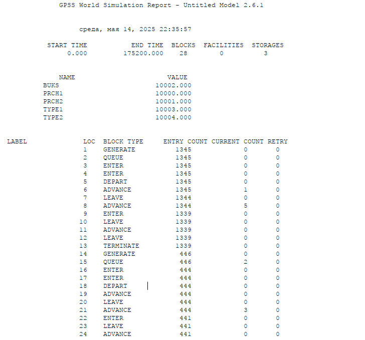
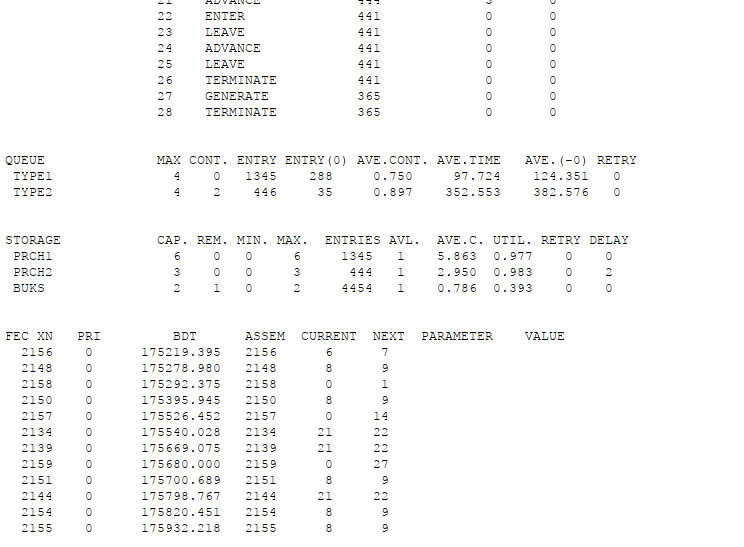

---
## Front matter
lang: ru-RU
title: Лабораторная работа №15
subtitle: Задание для самостоятельного выполнения
author:
  - Игнатенкова В. Н.
institute:
  - Российский университет дружбы народов, Москва, Россия

## i18n babel
babel-lang: russian
babel-otherlangs: english

## Formatting pdf
toc: false
toc-title: Содержание
slide_level: 2
aspectratio: 169
section-titles: true
theme: metropolis
header-includes:
 - \metroset{progressbar=frametitle,sectionpage=progressbar,numbering=fraction}
 - '\makeatletter'
 - '\beamer@ignorenonframefalse'
 - '\makeatother'
---

# Информация

## Докладчик

:::::::::::::: {.columns align=center}
::: {.column width="60%"}

  * Игнатенкова Варвара Николаевна
  * студентка
  * Российский университет дружбы народов
  * [1132226497@pfur.ru](mailto:1132226497@pfur.ru)
  * <https://github.com/vnignatenkovarudn>

:::
::: {.column width="25%"}

:::
::::::::::::::
## Задание

Реализовать с помощью gpss:

- модель обслуживания механиков на складе
- модель обслуживания в порту судов двух типов

# Выполнение лабораторной работы

## Модели обслуживания механиков с приоритетами

{#fig:001 width=70%}

## Модели обслуживания механиков с приоритетами

{#fig:002 width=70%}

## Модели обслуживания в порту двух типов

{#fig:003 width=70%}

## Модели обслуживания в порту двух типов

{#fig:004 width=70%}

## Модели обслуживания в порту двух типов

{#fig:005 width=70%}

## Выводы

В результате выполнения работы были реализованы с помощью gpss:

- модель обслуживания механиков на складе
- модель обслуживания в порту судов двух типов